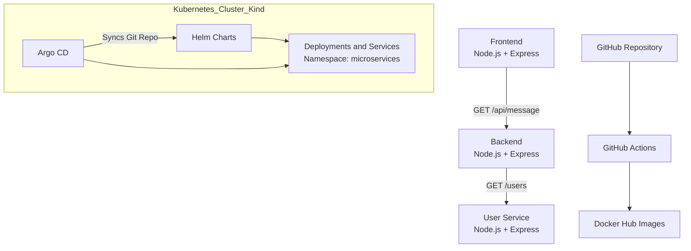

# Cloud-Native Microservices with GitOps

A complete 3-service microservices application built with Node.js and Express, containerized with Docker, packaged with Helm charts, and deployed declaratively to Kubernetes using GitOps with Argo CD.

---

## Overview

This project demonstrates a modern DevOps workflow for cloud-native microservices.

### Services

* **Frontend**
  A simple UI that calls the backend for data.

* **Backend**
  Provides a basic API endpoint at `/api/message`.

* **User Service**
  Exposes mock user data via `/users` and `/users/:id`.

### Key Features

* Docker containerization with images pushed to Docker Hub
* Helm charts for templated Kubernetes deployments
* Deployment to a local Kind Kubernetes cluster in the `microservices` namespace
* Declarative GitOps workflow using Argo CD with auto-sync and self-healing
* Inter-service communication via Kubernetes DNS, for example `http://backend:80`
* CI pipeline using GitHub Actions to automatically build and push images on every push to `main`

---

## Architecture



## Technologies

* **Languages and Frameworks:** Node.js, Express
* **Containerization:** Docker
* **Orchestration:** Kubernetes (Kind for local development)
* **Packaging:** Helm v3
* **GitOps and CD:** Argo CD
* **CI:** GitHub Actions
* **Container Registry:** Docker Hub (`anyasi/*:latest`)

---

## Project Structure

```
microservices-gitops/
├── argocd/                 # Argo CD application manifests
├── charts/
│   ├── backend/
│   ├── frontend/
│   └── user-service/
└── README.md

microservices-app/
├── backend/
├── frontend/
├── user-service/
└── .github/workflows/      # CI pipeline (build-push.yaml)
```

---

## Local Setup

### Prerequisites

* Docker
* Kind
* kubectl
* Helm
* Argo CD CLI (optional)

### Step 1: Create Kubernetes Cluster

```bash
kind create cluster --name dev-project
```

### Step 2: Create Namespace

```bash
kubectl create namespace microservices
```

### Step 3: Install Argo CD

```bash
kubectl create namespace argocd
kubectl apply -n argocd -f https://raw.githubusercontent.com/argoproj/argo-cd/stable/manifests/install.yaml
kubectl -n argocd get pods --watch
```

### Step 4: Access Argo CD UI

```bash
kubectl port-forward svc/argocd-server -n argocd 8080:443
kubectl -n argocd get secret argocd-initial-admin-secret \
  -o jsonpath="{.data.password}" | base64 -d; echo
```

Login at:

```
https://localhost:8080
Username: admin
Password: <retrieved password>
```

### Step 5: Deploy Applications

```bash
kubectl apply -f argocd/
kubectl get applications -n argocd -w
kubectl get pods -n microservices -w
```

### Step 6: Access Services

Frontend:

```bash
kubectl port-forward svc/frontend 8080:80 -n microservices
```

Open: http://localhost:8080

User Service:

```bash
kubectl port-forward svc/user-service 8081:80 -n microservices
```

Examples:

* http://localhost:8081/health
* http://localhost:8081/users
* http://localhost:8081/users/1

---

## CI/CD Pipeline

The GitHub Actions workflow located at:

```
.github/workflows/build-push.yaml
```

Performs the following:

* Triggers on push or pull request to `main`
* Builds Docker images for backend, frontend, and user-service
* Pushes `latest` tags to Docker Hub
* Uses build cache to speed up pipelines

Argo CD continuously watches the repository and automatically deploys updated images.

---

## Screenshots and Demo

Add screenshots demonstrating:

* Running pods in the `microservices` namespace
* Kubernetes services
* Argo CD dashboard showing synced applications
* Frontend UI response
* Successful GitHub Actions pipeline run

Optional: include a short demo video.

---

## Challenges and Learnings

* Resolving Helm template helper mismatches
* Configuring Kubernetes DNS for service-to-service communication
* Debugging Argo CD sync issues and namespace conflicts
* Using Helm values and environment variables instead of hard-coded URLs
* Leveraging force sync and pruning for consistent deployments

---

## Future Improvements

* Add an Ingress controller for clean external access
* Implement end-to-end testing in CI
* Add monitoring with Prometheus and Grafana
* Support multiple environments using ApplicationSets
* Introduce secure secret management

---

## Conclusion

This project demonstrates a full GitOps workflow for deploying and managing microservices on Kubernetes, combining containerization, CI/CD automation, and declarative infrastructure practices.